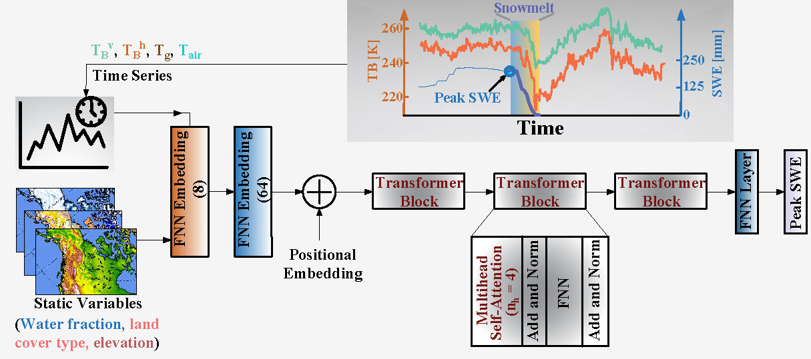

# SWEFormer
A transformer based deep learning architecture to predict the peak Snow water equivalent using L-band brightness temperature observations from NASA's SMAP satellite. 

In order to run this colab, download data from here
''' import gdown

# File ID from the Google Drive link
file_id = '1XgHYFKpmK0y7xfXNNdOc87h52_X2qaRS'

# Create the download URL
url = f'https://drive.google.com/uc?export=download&id={file_id}'

# Download the file and save it as 'Training_data_ERA5_datasets.pkl'
gdown.download(url, 'Training_data_ERA5_datasets.pkl', quiet=False) '''
